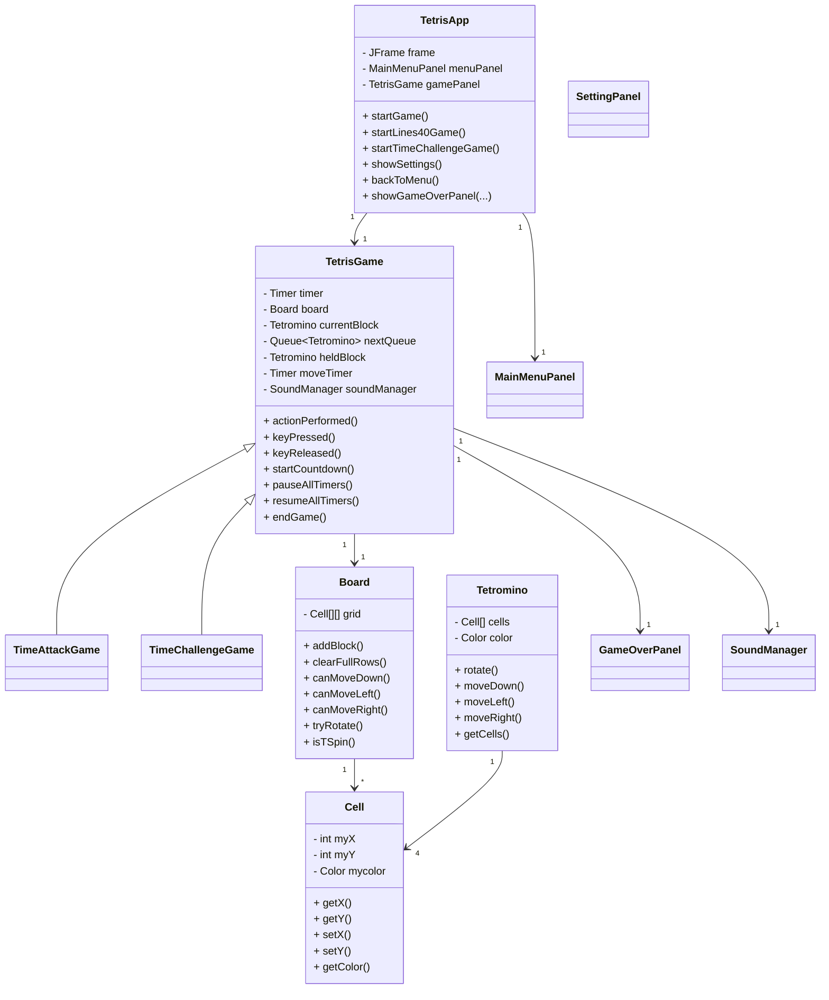
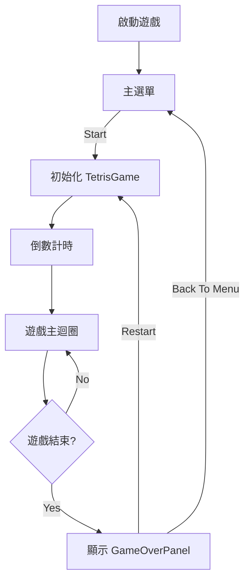
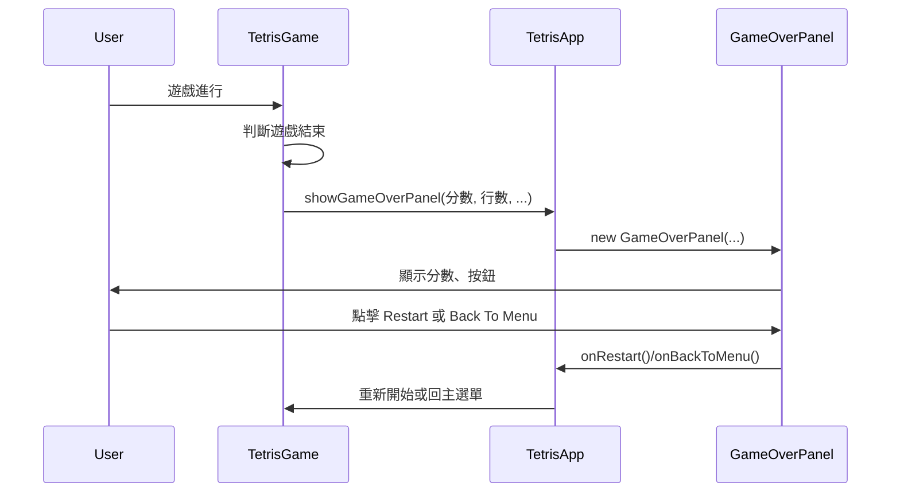

# 2025 JAVA 期末專案範例 — Tetris

- 學號：B11107129 姓名：陳敬橋
- 分工說明：無

---

## 遊戲說明

### 1. 遊戲流程
- 選擇模式（經典、40 行競速、限時挑戰）
- 方塊自動下落，玩家可旋轉、移動、快速下落、Hold
- 消除行數獲得分數，挑戰更高分與更快速度
- 遊戲結束時顯示結算畫面（分數、消除行數、T-Spin 次數、最大 Combo、遊戲時間）

### 2. 操作方式
- 左右移動：← / →
- 旋轉：↑
- 快速下落：↓
- 硬降（直接落地）：Space
- Hold 方塊：C
- 重新開始：結算畫面點選 Restart
- 回主選單：結算畫面點選 Back To Menu

---

## 執行方式

- 在src裡找到TetrisAPP.jar，點兩下開啟


---

## 檔案結構

```
Tetris/
├── src/
│   ├── TetrisApp.java
│   ├── TetrisGame.java
│   ├── TimeAttackGame.java
│   ├── TimeChallengeGame.java
│   ├── Board.java
│   ├── Cell.java
│   ├── Tetromino*.java
│   ├── GameOverPanel.java
│   ├── MainMenuPanel.java
│   ├── SettingPanel.java
│   ├── SoundManager.java
│   ├── Piano.java
│   ├── StringFader.java
│   └── ...
├── music/
│   ├── korobeiniki.wav
│   ├── tap.wav
│   └── ...
└── README.md
```

---

## 模式說明

- **經典模式**：無限遊玩，挑戰最高分
- **40 行競速**：最快消除 40 行
- **限時挑戰**：限時 30 秒內消除最多行

---

## 結算畫面顯示

- 分數
- 消除行數
- T-Spin 次數
- 最大 Combo
- 遊戲時間
- 重新開始按鈕
- 回主選單按鈕

---

## 主要功能列表

- 方塊隨機產生與 7-bag 隨機機制
- 方塊旋轉、移動、快速下落、Hold
- T-Spin 判斷與特效
- Combo、All Clear 特效
- 幽靈方塊顯示
- 分數與統計
- 結算畫面動畫按鈕
- 音效與背景音樂
- 主選單、設定畫面（音量調整）

---

## UML 類別圖與流程圖







---

## 製作人員

- 陳敬橋（B11107129）

---

# [Tetris 專案 HackMD 報告](https://hackmd.io/@38RTqktXQVu4OI2aHC0eQA/SJ4TUMdWgx)